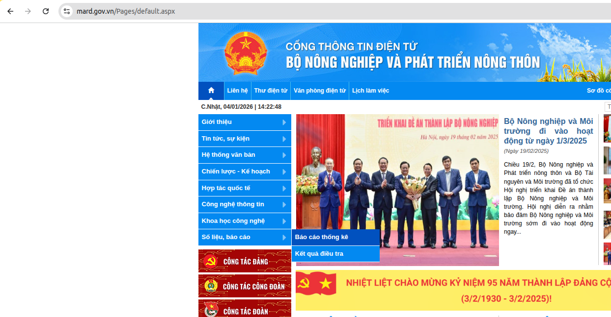
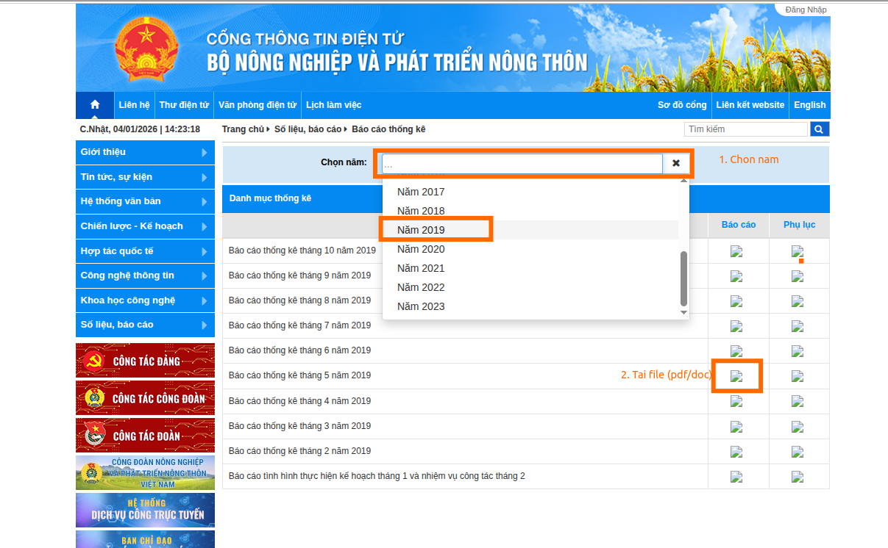

<p align="center">
  <a href="https://www.uit.edu.vn/" title="Trường Đại học Công nghệ Thông tin" style="border: none;">
    
  </a>
</p>

<h1 align="center"><b>Khai thác dữ liệu và ứng dụng - CS2207.CH203 - UIT</b></h1>

## Giới thiệu môn
-    **Tên môn học:** Khai thác dữ liệu và ứng dụng
-    **Mã môn học:** CS2207
-    **Giảng viên:** TS. Võ Nguyễn Lê Duy
-    **Email Giảng viên:** duyvnl@uit.edu.vn

## Thông tin nhóm 05
| STT | MSSV     | Họ và Tên         | Email                  |
| :-- | :------- | :---------------- | :--------------------- |
| 1   | 250101080 | Nguyễn Minh Chiến    | 250101080@gm.uit.edu.vn |
| 2   | 250101084 | Nguyễn Dương      | 250101084@gm.uit.edu.vn |
| 3   | 250101088 | Nguyễn Đình Huy  | 250101088@gm.uit.edu.vn |
| 4   | 250101091 | Ngô Đăng Khoa | 250101091@gm.uit.edu.vn |


# Vietnam Agricultural Dataset - Data Mining Project

> Xây dựng Dataset nông nghiệp Việt Nam từ dữ liệu phi cấu trúc (PDF/DOC) của Bộ Nông nghiệp và Phát triển Nông thôn

---

## Tổng quan

Dự án này xây dựng **Dataset có cấu trúc** về nông nghiệp Việt Nam từ các **báo cáo thống kê phi cấu trúc** (PDF, DOC) của MARD (2008-2023).

**Trạng thái hiện tại**: Phase 1 - Thu thập và Tiền xử lý dữ liệu

---

## Pipeline xây dựng Dataset

```
Phase 1: Thu thập & Tiền xử lý (← Hiện tại)
   - Tải báo cáo PDF/DOC từ website MARD
   - Convert sang Markdown (.md)

Phase 2: LLM Parsing (Sắp tới)
   - Trích xuất dữ liệu từ .md sang Dataset có cấu trúc
   - Xử lý format khác nhau qua các năm

Phase 3: Chuẩn hóa & Làm sạch (Sắp tới)
   - Xử lý dữ liệu thiếu, chuẩn hóa đơn vị

Phase 4: Data Mining & Analysis (Sắp tới)
   - Classification, Clustering, Time series analysis
```

---

## Bước 1: Tải dữ liệu từ MARD

### 1.1. Truy cập website

Vào [https://www.mard.gov.vn/Pages/default.aspx](https://www.mard.gov.vn/Pages/default.aspx)

Chọn mục **"Thống kê - Báo cáo"**:



### 1.2. Tải báo cáo theo năm

Chọn năm (2008-2023) và bấm **"Tải xuống"**:



### 1.3. Tổ chức dữ liệu

Lưu file vào thư mục theo năm:

```
DatasetDataset/
├── 2009/
│   ├── baocao_T10_2009_Final.pdf
│   └── baocao_T11_2009_Final.pdf
├── 2022/
│   ├── Baocao_T02_2022.doc
│   └── Baocao_T09_2022.pdf
└── ...
```

---

## Bước 2: Convert sang Markdown

### Cài đặt

```bash
pip install pymupdf4llm python-docx pypandoc
sudo apt-get install libreoffice
```

### Chạy conversion

```bash
python convert_all.py
```

Script tự động:
- Convert `.doc` → `.docx` (dùng LibreOffice)
- Convert `.pdf`, `.docx` → `.md` (dùng pymupdf4llm)
- Giữ nguyên cấu trúc thư mục
- Lưu kết quả vào `markdown_output/`

### Kết quả

```
markdown_output/
├── 2009/
│   ├── baocao_T10_2009_Final.md
│   └── baocao_T11_2009_Final.md
└── 2022/
    ├── Baocao_T02_2022.md
    └── Baocao_T09_2022.md
```

---

## Tài liệu

| File | Mô tả |
|------|-------|
| [PROJECT_OVERVIEW.md](PROJECT_OVERVIEW.md) | Tổng quan chi tiết về dự án, roadmap, ứng dụng |
| [QUICK_START.md](QUICK_START.md) | Hướng dẫn chi tiết từng bước |
| [CHEAT_SHEET.md](CHEAT_SHEET.md) | Quick reference commands |
| [convert_all.py](convert_all.py) | Script chính convert PDF/DOC → Markdown |

---

## Usage nâng cao

```bash
# Convert folder cụ thể
python convert_all.py --input ./2022

# Custom output directory
python convert_all.py --output ./my_markdown

# Force reconvert
python convert_all.py --no-skip

# Skip .doc conversion
python convert_all.py --skip-doc-conversion
```

---

## Troubleshooting

```bash
# Lỗi: pymupdf4llm not found
pip install pymupdf4llm

# Lỗi: LibreOffice not found
sudo apt-get install libreoffice

# Xem log chi tiết
cat conversion.log
```

Xem thêm: [QUICK_START.md#troubleshooting](QUICK_START.md#troubleshooting)

---

## Project Info

**Loại**: Đồ án Data Mining  
**Trường**: UIT (Đại học Công nghệ Thông tin)  
**Phase hiện tại**: Phase 1 - Thu thập & Tiền xử lý  
**Version**: 1.0  
**Last Updated**: 2026-01-04

---

## License

MIT License - Free to use for educational and research purposes
