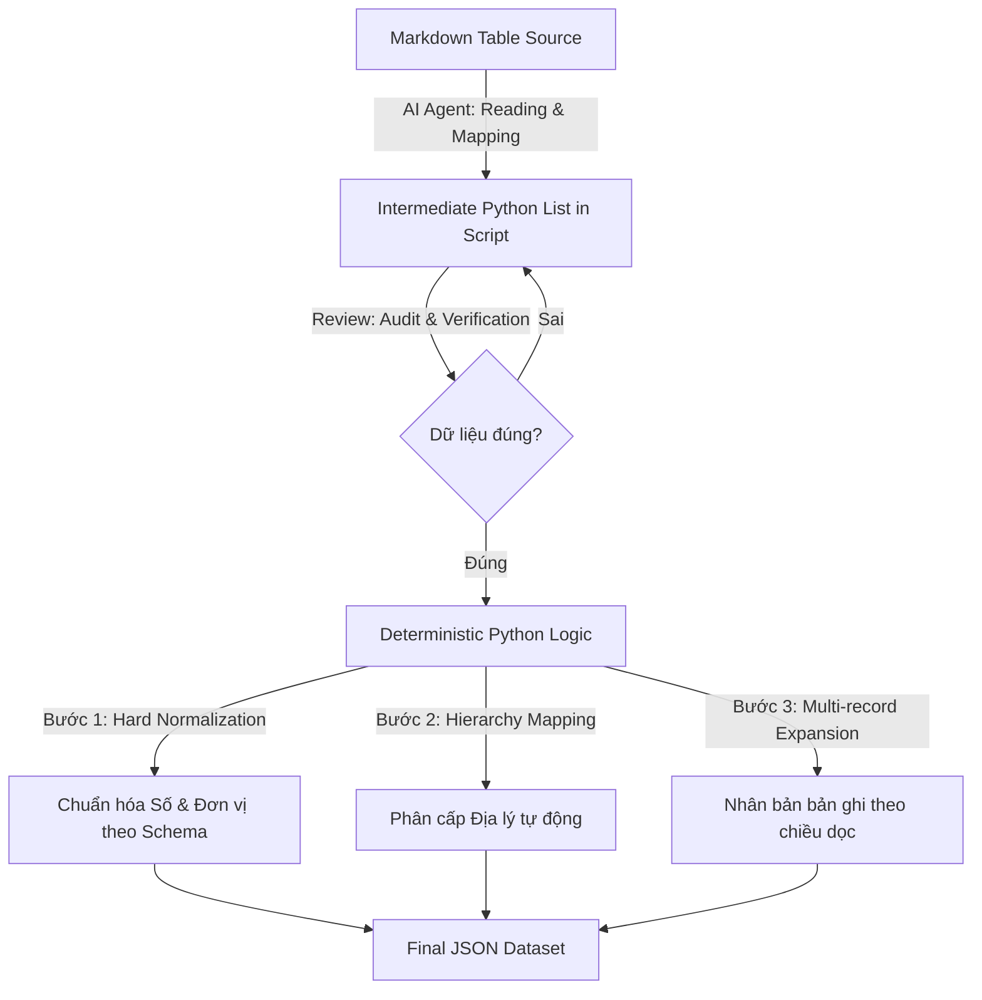

# BÁO CÁO PHƯƠNG PHÁP TRÍCH XUẤT DỮ LIỆU NÔNG NGHIỆP BẰNG AI AGENT (ANTI GRAVITY)

## 1. GIỚI THIỆU TỔNG QUAN
Trong dự án xử lý dữ liệu nông nghiệp Việt Nam từ các báo cáo dạng Markdown (số lượng lớn, cấu trúc bảng phức tạp và không đồng nhất), chúng tôi đã áp dụng giải pháp **Hybrid AI-Deterministic Extraction**. Giải pháp này sử dụng **Anti Gravity (AG)** làm **AI Agent** nòng cốt để thực hiện các tác vụ từ đọc hiểu ngữ cảnh đến lập trình tự động.

## 2. KIẾN TRÚC HỆ THỐNG & PIPELINE

Hệ thống được vận hành dựa trên sự kết hợp giữa khả năng nhận diện ngôn ngữ tự nhiên của AI và tính chính xác tuyệt đối của lập trình truyền thống.

### Sơ đồ quy trình (Data Extraction Pipeline)

---

## 3. CÁC THÀNH PHẦN CHI TIẾT

### 3.1. Cấu hình AI Agent (Skills & Workflows)
Chúng tôi cung cấp cho Agent hai tài liệu nền tảng làm "tri thức":
*   **Skill (`schema_improved_v2.json`):** Định nghĩa cấu trúc dữ liệu đầu ra bắt buộc (long-format).
*   **Workflow (`LLM_EXTRACTION_GUIDE.md`):** Quy trình xử lý các trường hợp đặc biệt (Header đa tầng, ô trống, lỗi encoding).

### 3.2. Dữ liệu trung gian (Intermediate Clean Room)
Thay vì yêu cầu AI xuất trực tiếp kết quả JSON từ file Markdown 100 dòng (dễ gây quá tải bộ nhớ và sai sót), Agent thực hiện trích xuất dữ liệu thô vào một **Python List phẳng** ngay trong script.
*   **Lợi ích:** 
    *   **Tính kiểm chứng (Auditable):** Người dùng có thể đọc code và kiểm tra danh sách dữ liệu thô ngay lập tức để xác nhận AI có đọc sót tỉnh hay lệch cột hay không.
    *   **Phá vỡ giới hạn Context:** Giúp xử lý các bảng cực dài mà không lo AI bị "đuối" ở giữa file.

### 3.3. Mô hình "Code Gánh Logic - AI Gánh Đọc Hiểu"
Phân định trách nhiệm rõ ràng để tối ưu hóa sức mạnh của từng bên:
*   **AI (Đọc hiểu):** Đọc bảng Markdown phức tạp, nhận diện tên tỉnh, bốc số liệu thô đưa vào danh sách trung gian.
*   **Code Python (Logic):** Thực hiện tính toán (chia 1000 để đổi đơn vị Ha -> 1000ha), tạo mã định danh duy nhất (UUID), và tách record.
    *   *Ví dụ:* Một dòng dữ liệu thô chứa cả số của năm 2008 và 2009 sẽ được code tự động nhân bản thành 2 records JSON riêng biệt. Điều này khắc phục tình trạng AI "lười" thường chỉ lấy số năm hiện tại.

### 3.4. Xử lý Phân cấp (Hierarchy) bằng Deterministic Code
Thay vì kỳ vọng AI đoán đúng cấp hành chính (Vùng hay Tỉnh), chúng tôi lập trình sẵn danh sách các Vùng (`regional = ["Miền Bắc", "Đông Bắc", ...]`). 
*   **Cơ chế:** Code sẽ so sánh tên địa phương với danh sách này để tự động gán `geo_level` (Regional/Provincial). Điều này **triệt tiêu hoàn toàn sai sót** trong việc phân loại cấp địa lý.

### 3.5. Hàm Chuẩn hóa "Cứng" (Hard Normalization)
Agent lập trình hàm `normalize_number()` để xử lý các lỗi dữ liệu thô từ OCR hoặc Markdown:
*   Xóa dấu phẩy ngăn cách hàng nghìn (định dạng VN: `1.234,5` -> `1234.5`).
*   Loại bỏ các ký tự nhiễu như dấu sao (`*`), gạch ngang (`-`), hay thẻ ` `.
*   **Kết quả:** Đầu ra luôn là kiểu `float` hoặc `None`, đảm bảo tính toàn vẹn dữ liệu cho quá trình Data Mining sau này.

---

## 4. KẾT LUẬN
Phương pháp sử dụng AI Agent theo hướng tiếp cận **Hybrid** mang lại sự cân bằng hoàn hảo giữa:
1.  **Tốc độ:** AI đọc và mapping bảng nhanh hơn con người gấp nhiều lần.
2.  **Độ chính xác:** Logic lập trình đảm bảo dữ liệu luôn nhất quán với schema.
3.  **Khả năng kiểm soát:** Dữ liệu trung gian giúp người dùng dễ dàng giám sát và điều chỉnh mà không cần chạy lại toàn bộ quy trình.

---
*Tài liệu này mô tả phương pháp làm việc được thực hiện bởi Anti Gravity AI Agent.*

### 3.6. Chiến thuật "Batch & Conquer" (Chia để trị)
Một bài học xương máu khi xử lý hàng trăm file: **Không bao giờ xử lý tất cả cùng lúc**.
*   **Quy tắc số 4:** Chỉ process tối đa 3-4 file markdown trong một lượt (batch). Điều này giúp giữ context window của LLM sạch sẽ, tránh ảo giác (hallucination) và tránh tràn output token.
*   **Fail-fast:** Nếu một batch bị lỗi, nó không ảnh hưởng đến các batch khác.

### 3.7. Tư duy "Hard-Code is Okay" cho Edge Cases
Chúng ta thường cố gắng viết một script "thông minh" để xử lý mọi trường hợp. Nhưng với dữ liệu "bẩn" (OCR lỗi, bảng nén dòng), **script "ngu" nhưng chính xác** lại tốt hơn.
*   **Ví dụ:** Nếu bảng bị nén dòng bằng thẻ ` ` và mất cấu trúc hàng/cột, đừng cố viết Regex phức tạp. Hãy copy nguyên `raw string` của dữ liệu vào Python list và map thủ công index. Tốn 5 phút gõ tay nhưng tiết kiệm 50 phút debug Regex sai.
*   **Ưu tiên:** Độ chính xác > Tự động hóa hoàn toàn. Nếu AI không handle được, hãy hard-code dữ liệu đó trong script.

### 3.8. Xử lý File "Lạc Loại" (Loop Back)
Đừng để một file khó chặn đứng cả tiến độ.
*   Gặp file lỗi cấu trúc lạ (PL2 compacted, PL10 Sugar)? **Skip và Note lại.**
*   Làm xong các file dễ.
*   Quay lại xử lý các file khó bằng một script chuyên biệt (Batch riêng) với logic custom.
